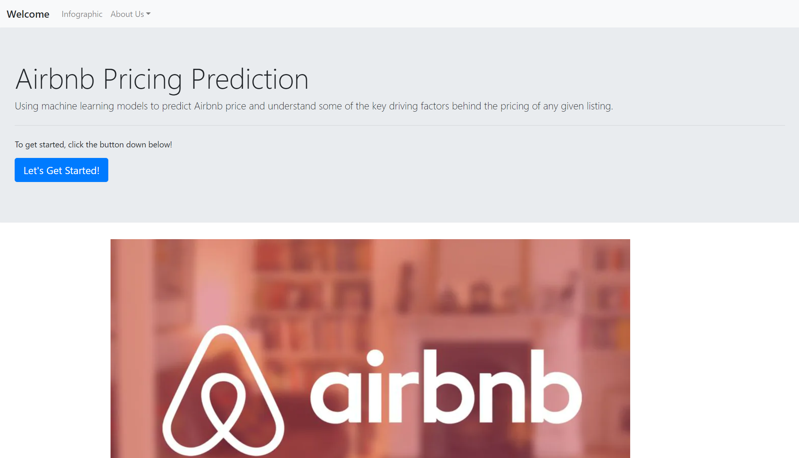
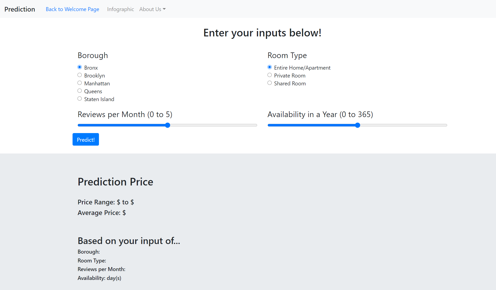
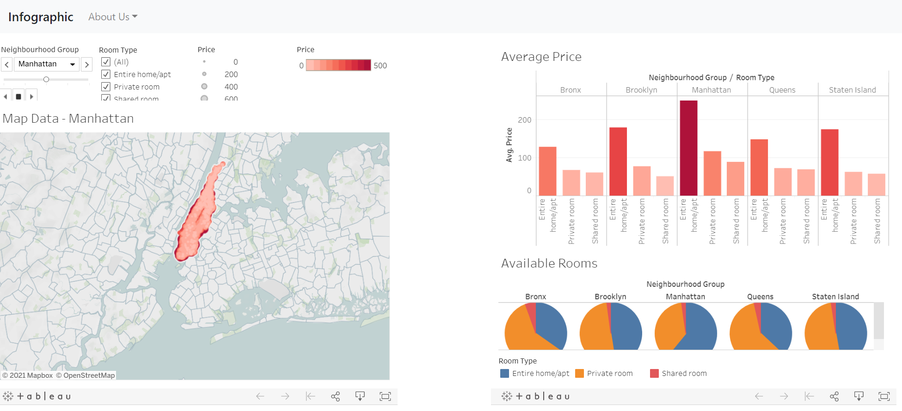

# Airbnb Price Prediction Application
The purpose of this project is to create a price prediction app for Airbnb NYC housings through various inputs such as borough, room type, reviews per month, and availability in a year.

You can access the application through the link: https://jdkwak1994-airbnb-price-predic.herokuapp.com/

### Dataset Sources:
* link here

---

### Project Description
**Step 1: Machine Learning Models**
- descriptions here

**Step 2: HTML/CSS/JS**
- descriptions here

**Step 3: Flask App and Heroku Deployment**
- descriptions here

---

### Sample Screenshots
* **Main Page**

* **Prediction Page**

* **Infographic Page**

---

### Getting Started
